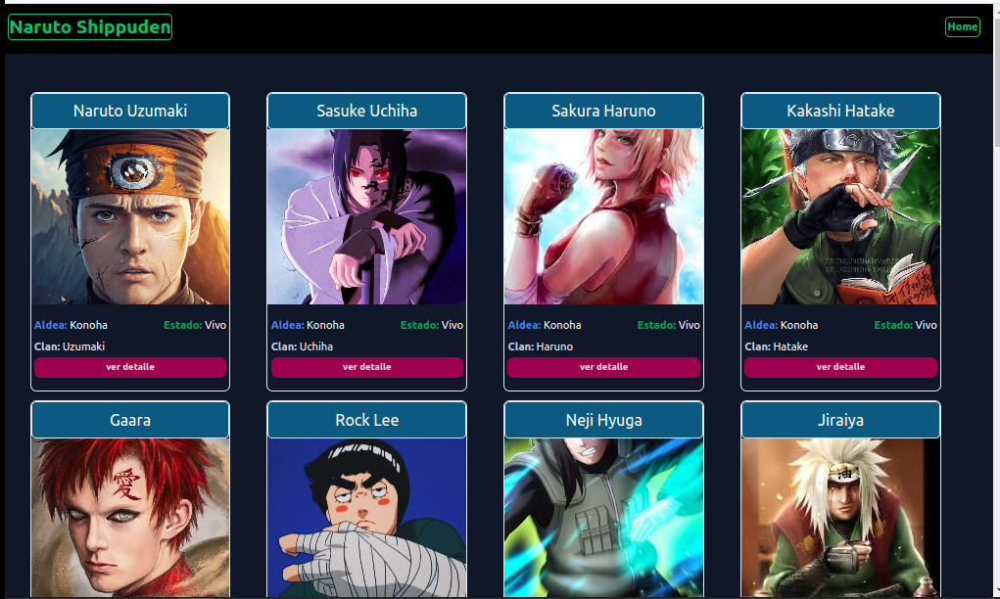

# Proyecto Naruto con Typescript

Este es un proyecto poniendo en practica typescript ,se ha creado un json donde se consume la informacion para listar y mostrar el detalle

- Esta creado con`nextjs` , `typescript` , `taildwindcss`



## Getting Started

First, run the development server:

```bash
npm run dev
# or
yarn dev
# or
pnpm dev
# or
bun dev
```

Open [http://localhost:3000](http://localhost:3000) with your browser to see the result.

You can start editing the page by modifying `app/page.tsx`. The page auto-updates as you edit the file.

This project uses [`next/font`](https://nextjs.org/docs/basic-features/font-optimization) to automatically optimize and load Inter, a custom Google Font.

## React

Tenemos la folder components donde tenemos la siguente estructura

```bash
├── client/ # Carpeta para el frontend
│   ├── public/ # Archivos públicos como el index.html
│   ├── src/ # Código fuente del frontend
│   │   ├── components/ # Componentes de React
│   │   │   ├── Card.tsx # Componente Card
│   │   │   ├── List.tsx # Componente List
│   │   │   └── NavBar.tsx # Componente NavBar
│   │   ├── interfaces/ # Interfaces TypeScript
│   │   │   └── Ninja.ts # Definición de la interfaz Ninja
│   │   ├── json/ # Archivos JSON de datos
│   │   │   └── ninjas.json # Datos de ninjas
│   │   ├── App.tsx # Componente principal de React
│   │   └── index.tsx # Punto de entrada de la aplicación React
│   ├── package.json # Dependencias del frontend
│   └── ...
│
├── .gitignore # Archivos y carpetas ignorados por Git
└── README.md # Documentación del proyecto

```

Se creo una sola ruta en src/app/shippuden/[id] para mostrar el ninjaDetail

### Interfaces

Se maneja los tipos de los campos

```javascript
export type Ninja = {
  id?: number,
  nombre: string,
  avatar?: string,
  edad: number,
  aldea: string,
  clan: string,
  estado: string,
  habilidades: Array<string>,
  historia: string,
};

export type Ninjas = Ninja[];
```

### component App

En nextjs se usa page.tsx como page principal que seria normalmente app.tsx

```javascript
"use client";

import narutoJson from "../json/ninjas.json";
import { Ninjas, Ninja, TypesNinja, ActionNinja } from "@/interfaces/Ninja";
import List from "@/components/List";

//============hooks====================================
import { useEffect, useState, useReducer } from "react";
import { useNinjas } from "@/hooks/useNinjas";
//================================================

export default function Home() {
const [dataJson, setDataJson] = useState<Ninjas>([] as Ninjas);

useEffect(() => {
 setDataJson(narutoJson)
}, []);

  return (
    <div>
      <List ninjas={dataJson} />
    </div>
  );
}
```

### useReducer

Ahora implementare el useReducer que es un hooks pero lo hare en un componente aparte creando un customHook que me retorna un state y un dispatch

Primero agregaremos los tipos nuevos para el useReducer, yo los agregue al Ninjas.ts que ya teniamos definido como tipos.

```javascript
//==========para el useReducer defino los tipos============

export const TypesNinja = {
  ADD_NINJA: "ADD_NINJA",
  LIST_NINJA: "LIST_NINJA",
} as const;
/*El uso de as const en la definición de TypesNinja le indica a TypeScript que las
propiedades del objeto son literales de cadena y no valores de cadena generales.
Esto asegura que las propiedades ADD_NINJA y LIST_NINJA sean tratadas como tipos
literales específicos, mejorando la precisión del tipado
 */

export type ActionNinja =
  | { type: typeof TypesNinja.ADD_NINJA; payload: Ninja }
  | { type: typeof TypesNinja.LIST_NINJA; payload: Ninjas };

```

Ahora el CustomHook

```javascript
import narutoJson from "../json/ninjas.json";
import { Ninjas, Ninja, TypesNinja, ActionNinja } from "@/interfaces/Ninja";

//============hooks====================================
import { useReducer, useEffect } from "react";
//================================================

//===================useReducer🤖🤖🤖🤖=============================

type InitialStateProps = {
  ninjas: Ninjas;
};

//creamos un estado inicial
const InitialState: InitialStateProps = {
  //ninjas: narutoJson as Ninjas,
  ninjas: [] as Ninjas,
};

export const NinjasReducer = (
  state: InitialStateProps,
  action: ActionNinja
) => {
  switch (action.type) {
    case TypesNinja.LIST_NINJA:
      return {
        ...state,
        ninjas: action.payload,
      };

    default:
      return state;
  }
};

//================================================

// Custom hook para manejar el estado de los ninjas
export const useNinjas = () => {
  const [state, dispatch] = useReducer(NinjasReducer, InitialState);

//mosntamos los ninjas al state
  useEffect(() => {
    // Cargar datos iniciales
    dispatch({ type: TypesNinja.LIST_NINJA, payload: narutoJson as Ninjas });
  }, []);


//=================retornamos sttate y dispatch=============
  return [state, dispatch] as const;
};

```

y el page.tsx ahora me queda asi

```javascript
"use client";

import List from "@/components/List";

//============hooks====================================

import { useNinjas } from "@/hooks/useNinjas";
//================================================

export default function Home() {
  const [state, dispatch] = useNinjas();

  return (
    <div>
      <List ninjas={state.ninjas} />
    </div>
  );
}
```

## Deploy on Vercel

- usare Vercel
