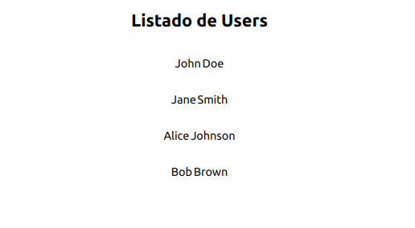
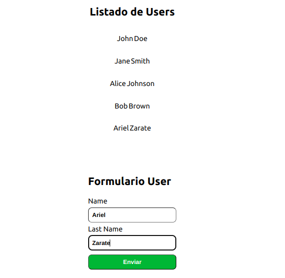
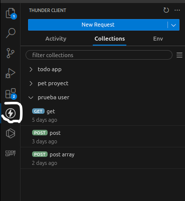
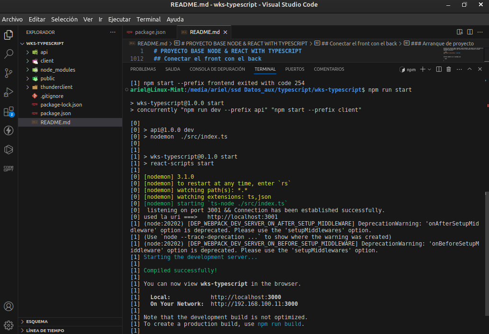

# PROYECTO BASE NODE & REACT WITH TYPESCRIPT

Este proyecto tendra la creacion desde la base de un proyecto en `NODEJS` y `REACT` usando `Typescript`

Debemos en un inicio crear un folder que sera un contenedor que tendra el backend y el front en el mismo proyecto
Estructura

```bash
mi-proyecto/
│
├── api/ # Carpeta para el backend
│ ├── src/ # Código fuente del backend
│ │ ├── controllers/ # Controladores para manejar las peticiones
│ │ ├── models/ # Modelos de la base de datos
│ │ │ └── User.ts # Modelo de usuario
│ │ ├── libs/ # Librerías y configuraciones
│ │ │ ├── db.ts # Configuración de la base de datos
│ │ │ └── config.ts # Configuración general
│ │ ├── routes/ # Rutas de la API
│ │ ├── app.ts # Archivo de configuración de la app
│ │ └── index.ts # Punto de entrada del backend
│ ├── package.json # Dependencias del backend
│ ├── .env # Variables de entorno para el backend
│ └── ...
│
├── client/ # Carpeta para el frontend
│ ├── public/ # Archivos públicos como el index.html
│ ├── src/ # Código fuente del frontend
│ │ ├── components/ # Componentes de React
│ │ ├── App.ts # Componente principal de React
│ │ └── index.ts # Punto de entrada de la aplicación React
│ ├── package.json # Dependencias del frontend
│ └── ...
│
├── .gitignore # Archivos y carpetas ignorados por Git
├── README.md # Documentación del proyecto
└── package.json # (Opcional) Si quieres manejar scripts para ambos, backend y frontend

```

## Base de datos

Usare mysql , pueden usar postgres,MongoDB,etc

```bash
npm i mysql2
```

## Back-end

### Dependecias

Primero creamos una carpeta que se llame api, y en la consola usamos el siguiente ocomando:

```bash
  npx tsc --init
```

¿Qué realiza ese comando? Nos genra un archivo llamado tsconfig.json, en el cual vamos a configurar nuestro compilador. Dentro nos vamos a encontrar diferentes, las mas importantes que tenemos que revisar son:

```javascript
    "target": "es6",
    "module": "commonjs",
    "outDir": "./dist",
```

Esas son las configuraciones que va a realizar el compilador para convertir nuestro codigo typescript a javascript para que node lo pueda entender. Target es el standard, commonjs es el modo como van a generarse los modulos y outdir es la carpeta donde se va a guardar nuestro codigo typescript.
Para poder utilizar la libreria de sequelize, es necesario que habilitemos los decoradores y utilicemos ES6, por lo que dejamos target en "es6" y activamos las siguientes opciones:

```javascript
    "experimentalDecorators": true,
    "emitDecoratorMetadata": true,
```

Ahora procedemos a generar nuestro package.json, utilizando el comando:

```bash
npm init
```

Le colocamos el nombre que deseemos, y comenzamos a instalar dependencias:

Instalamos lo que usariamos normalmente en una aplicación de express

```bash
npm i cookie-parser cors dotenv express  sequelize typescript
```

Y realizamos otra instalación, noten acá que tambien estamos instalando dependencias con @types ¿Qué son estos @types?
Asi como nosotros tenemos que agregarle los tipos a todos nuestros objetos y funciones, las librerias tambien, entonces necesitamos instalarlas.
Además estamos instalando ts-node, que es el que nos va a permitir utilizar nodemon con typescript!

```bash
npm i @types/cookie-parser @types/cors @types/express @types/morgan @types/node @types/pg morgan nodemon ts-node --save-dev
```

Ahora modificamos nuestro script, agregamos el comando

```javascript
  "scripts": {
    "dev": "nodemon index.ts"
  },
```

Otra opcion valida ya hace rato es no usar nodemon y usar tsc-watch
tsc-watch es una utilidad que simplifica el proceso de ver los cambios en los archivos TypeScript y reiniciar Node.js automáticamente. Puedes instalarlo como una dependencia de desarrollo:

```bash
npm install  tsc-watch -D
```

La `-D` indica que es de desarrollo.

Ahora creemos nuestro index.ts en nuestra carpeta api y ya podemos comenzar!

Ese va a ser nuestro punto de entrada, basicamente, es donde vamos a usar nuestro app.listen y sequelize.sync, antes de eso, creemos una carpeta que se llame src, y ahi dentro creemos nuestro app.ts y comencemos a configurar nuestra aplicacion de express!

```javascript
import express from "express";
const app = express();
export default app;
```

Primero podemos notar dos cosas, uno, podemos usar es6 dentro de node.js, y que, dependiendo de nuestra configuracion, app probablemente nos este dando un error ¿Por qué? Porque le faltan los tipos! Entonces:

```javascript
import express, { Application } from "express";
const app: Application = express();
export default app;
```

Lo que estamos haciendo ahi, es decirle nuestra variable app que es una Application de express. Ahora, seguro estas pensando ¿Como hago yo para saber eso? Simple! Esta en la documentacion. Casi todos los paquetes de npm tienen soporte para typescript, algunos hasta estan escritos en TS!

Antes de continuar, seteemos nuestras variables de entorno, para eso, hagamos un archivo de configuracion. Creemos una carpeta llamada lib, y dentro de ella un archivo que se llame config.ts

#### src/libs/config.ts

Adentro de config.ts, vamos a obtener nuestros valores de las variables de entorno:

```javascript
import dotenv from "dotenv";

dotenv.config();

const config = {
  dbUser: process.env.DB_USER || "root", //en postgres es "postgres" por defecto
  dbPassword: process.env.DB_PASSWORD || "", //en postgres es postgres por defecto, deben ver!!
  dbHost: process.env.DB_HOST || "localhost",
  dbName: process.env.DB_NAME || "workshop",
  dbPort: process.env.DB_PORT || "3306", //en postgres es 5423 o el que tengas definido
  dev: process.env.NODE_ENV !== "production",
  port: process.env.API_PORT || "3000", //yo use el 3001 porque el front es el 3000 para no confundirme
  host: process.env.API_host || "localhost",
  cors: process.env.CORS || "localhost:3000",
};

export default config;
```

Para esto, tambien deberiamos crear nuestro archivo .env, de la siguiente manera:

```bash
DB_USER="root"
DB_PASSWORD="admin"
DB_HOST="localhost"
DB_NAME="workshop" #elnombre que tu quieras ponerle
DB_PORT="3306"
NODE_ENV="development"
API_PORT="3001" #el puerto que tu quieras
API_HOST="localhost"
CORS="http://localhost:3000"
#esta es la ruta a la cual vamos aceptar peticiones del front
```

Ahora seteemos nuestros headers y cors,

```javascript
const app = express();
dotenv.config(); //config environment variables
app.locals.name = "Api with typescript";

app.set("port", config.port || 3000); //default port
//=========|config|================================
import config from "./libs/config";

app.use(express.urlencoded({ extended: true, limit: "50mb" })); //middleware
app.use(express.json({ limit: "50mb" }));
app.use(cookieParser());
app.use(morgan("dev"));

app.use(
  cors({
    origin: config.cors,
    credentials: true,
    methods: ["GET", "POST", "OPTIONS", "PUT", "DELETE"],
    allowedHeaders: ["Origin", "X-Requested-With", "Content-Type", "Accept"],
  })
);

export default app;
```

Nuestro middleware de control de errores nos esta dando problemas, necesita que le especifiquemos su tipado!
Entonces, tenemos que obtener de express NextFunction, Request y Response, pero ¿Y err?
Bueno, no existe un tipado para los errores, existen varias formas de resolver ese problema. Principalmente porque los errores se declaran de distinta forma dependiendo de su origen.
La forma mas sencilla es que hagamos una interface!

```javascript
import express, { Request, Response, NextFunction } from "express";

//========interface================================

interface Error {
  status: number;
  message: string;
}

//========================================

//middleware para routes invalidas
app.use((err: Error, req: Request, res: Response, next: NextFunction) => {
  const status = err.status || 500;
  const message = err.message || err;
  console.log(err);
  res.status(status).json(message);
});
```

Genial, ahora lo que tenemos que hacer es probar nuestra configuracion, para eso generamos una ruta!

```javascript
app.get("/", (req: Request, res: Response) => {
  res.send("hola typescript!");
});
```

Yo siempre separo el app.ts que es archvivo donde tengo toda la logica de express del archivo index.ts que esta el listen del puerto .

Y en nuestro archivo index.ts, el que esta en la carpeta raiz:

Nota: tengo el archivo index.ts en el mismo nivel del app.ts en mi caso (todo dentro de src(folder))

```javascript
import app from "./app";

app.listen(app.get("port"), () => {
  console.log(` listening on port ${app.get("port")}`);
});
```

Como pueden ver, la unica diferencia con express normal es que tenemos que agregar ciertos tipados! Probamos que funcione, y debuggeamos nuestro código.

Una vez que funcione, creamos nuestra carpeta routes!
Todavía no te conte que tipo de app vamos a hacer, la idea es hacer modelo de usuario con nombre y apellido.
Entonces, en la carpeta routes creamos nuestro index.ts y user.ts
En user.ts generamos nuestras rutas!

```javascript
import { Response, Request, Router } from "express";

router.get("/", (req: Request, res: Response) => {
  res.send("soy la ruta get!");
});

router.post("/", (req: Request, res: Response) => {
  res.send("soy la ruta post!");
});

export default router;
```

Y en nuestro index.ts dentro de la carpeta routes:

```javascript
import express from "express";
const router = express.Router();
import user from "./user";

router.use("/user", user);

export default router;
```

Ahora volvemos a nuestro app.ts, y agregamos nuestras rutas!

```javascript
//==========|routes|==============
import indexRoutes from "./routes/index";

app.use("/api", indexRoutes);
//====================================
```

Una vez tenemos nuestras rutas, lo que vamos a hacer es crear la conexion con la base de datos. En src/libs cremos otro archivo llamado db.ts

#### src/libs/db.ts

```javascript
import { Sequelize } from "sequelize";
import config from "./config";
// Option 3: Passing parameters separately (other dialects)
const sequelize = new Sequelize(
  config.dbName,
  config.dbUser,
  config.dbPassword,

  {
    host: config.dbHost,
    dialect:
      "postgres" /* one of 'mysql' | 'postgres' | 'sqlite' | 'mariadb' | 'mssql' | 'db2' | 'snowflake' | 'oracle' */,

    logging: false,
    native: false,
    define: {
      timestamps: true, //me guarda la hora que se crea
    },
  }
);

//exportamos la instancia
export default sequelize;
```

Ahora vamos a crear el modelo con sequelize...

### Creando modelo con sequelize

Para esta guia, solo vamos usar nombre y apellido.
en User.ts vamos a generar nuestro modelo con la libreria sequelize.

#### Notar: que importamos la conexion de sequelize generada en la bd.ts

##### Modelo

```javascript
import { DataTypes } from "sequelize";
import sequelize from "../libs/db";

const User = sequelize.define(
  "User",

  {
    id: {
      type: DataTypes.UUID,
      allowNull: false,
      primaryKey: true,
      autoIncrement: true,
      defaultValue: DataTypes.UUIDV4,
      unique: true,
    },

    name: {
      type: DataTypes.STRING,
      allowNull: false,
    },

    lastNane: {
      type: DataTypes.STRING,
      allowNull: false,
    },
  }
);

export default User;
```

El modelo tiene un id con propiedades unique , uuid , autoincrement ,etc.

Como ven, tienen que generar un nuevo Sequelize, pasarle esa informacion en un objeto!
Advertencia: Si la carpeta no se llama models, no va a funcionar, y cada archivo dentro de la carpeta models debe tener la primer letra en mayuscula.
Ahora lo único que nos falta es inicializar nuestro sequelize y sincronizar la base de datos!
Volvemos a nuestro index.ts de la carpeta raiz y generamos nuestra conexion.

```javascript
import { sequelize } from "./src/db";
import app from "./src/app";
sequelize
  .sync({ force: true, logging: false })
  .then(() => {
    console.log("base de datos conectada! :D");
    app.listen(3001, function () {
      console.log("App is listening on port 3001!");
    });
  })
  .catch((err) => console.error(err));
```

### Otra opcion es usar sequelize -typescript

Necesitamos instalar la dependencia de de sequelize-typescript, usaremos sequelize-typescript para crear un modelo con decoradores similar al uso de frameworks como `SpringBoot (java)` o `NestJs(node y express) `

Entonces, creamos la carpeta models (en nuestro caso ya la teniamos creada), y ahora es donde van a comenzar a notar diferencia y vamos a aprender lo que son los decoradores.
En la carpeta models creamos User.ts
en User.ts vamos a generar nuestro modelo con la libreria sequelize-typescript, en vez de realizar la funcion de sequelize con sequelize.init() y sus metodos, vamos a generar una clase con decoradores!

Primero ¿Qué es un decorador?
Los decoradores son un patron de diseño, el cual se ejecuta atado a una funcion, una clase o una propiedad. Entonces, siempre los vamos a ver arriba de una de esas!
Son muy utilizados en el framework angular y otras librerias, como sequelize-typescript, ahora vamos a ver que son muy sencillos de usar!
Para usarlos lo unico que tenemos que hacer es:

```javascript
@NombreDelDecorador
funcion() // o el metodo o clase o atributo
```

Entonces, nos tenemos que traer de sequelize-typescript y usemos nuestro primer decorador!

```javascript
import {
  Model,
  Column,
  Table,
  CreatedAt,
  UpdatedAt,
} from "sequelize-typescript";
@Table
export class User extends Model<User> {}
```

@Table es nuestro decorador, prestemos un poco de atencion que esta sucediendo ahi. Estamos generando la clase User, que se extiende de Model. Entonces, esta herando todos los metodos de Model.
¿Y Table? ¿Que hace Table?
Table hace que la clase User se ejecute de determinada manera. Condiciona como se tiene que ejecutar, en este caso, lo que hace es generarnos la tabla de postgres por nosotros!
Entonces, agreguemos nuestras columnas, tambien con decoradores!

```javascript
@Table
export class User extends Model<User> {
 @Column
 name!: string;

 @Column
 lastName!: string;

 @CreatedAt
 @Column
 createdAt!: Date;

 @UpdatedAt
 @Column
 updatedAt!: Date;
}
```

Fijte que sencillo es! Si quisieramos agregar otros atributos, podemos agregar mas decoradores arriba o llamarlos de otra forma, @Column({//aca irian nuestros atributos})
Asi mismo, tambien dentro de la clase deberiamos generar nuestras relaciones! No en un archivo afuera, te invito a que leas la documentacion de sequelize-typescript para que veas como se hace! Es muy sencillo.

Ahora, en nuestro archivo db.ts (cambia un poco) al que teniamos creado tenemos que generar nuestra conexion con la db!

```javascript
import { Sequelize } from "sequelize-typescript";
import config from "./lib/config";
config;
export const sequelize = new Sequelize({
  dialect: "postgres",
  database: config.dbName,
  password: config.dbPassword,
  username: config.dbUser,
  storage: ":memory:",
  models: [__dirname + "/models"],
});
```

En este caso el ejemplo te muestra como el `storage` se guarda en memoria usando el modelo de ` __dirname + /models` es otra opcion valida solo para probar , pero no tiene persistencia en la bd realmente.

- solo hay que cambiar el modelo User.ts y ajustar el archivo db.ts para usar esta opcion.

Entonces, lo unico que nos falta seria agregar a nuestras rutas la conexion con nuestros modelos! Lo hacemos de forma muy parecido a como lo hacemos con javascript normal!

```javascript
router.get("/", (req: Request, res: Response, next: NextFunction) => {
  User.findAll()
    .then((users) => {
      res.send(users);
    })
    .catch((error) => next(error));
});

router.post("/", (req: Request, res: Response, next: NextFunction) => {
  const user = req.body;
  User.create(user)
    .then((createdUser) => {
      res.send(createdUser);
    })
    .catch((error) => next(error));
});
```

De esta forma, nuestro back quedaria completo.

## Front-end

### Estructura del proyecto

```bash
src/
├── redux/
│   ├── store.ts
│   └── features/
│       ├── UserSlices.ts
│       └── CounterSlices.ts //ejemplo viejo
├── components/
│   └──User.ts
|   └──Contador.ts //ejemplo de contador viejo
├── App.tsx
├── index.tsx
└── ...

```

### Dependecias

En las dependencias del package.json del boilerplate ya van a estar incluidas `npm install @reduxjs/toolkit react-redux` y `axios` (opcional) por lo que simplemente con el `npm install` del comienzo ya alcanzaría, pero si comienzan desde cero en un proyecto separado recuerden que deben instalar las mismas.

- documentacion de [Redux](https://redux.js.org/introduction/getting-started)

```bash
  npm install @reduxjs/toolkit react-redux axios
```

### useContext - useReducer

Otra opcion es usar los hook de react si usar librearias externas

- useReducer()
- useContext()

### Zustand

Otra opcion menos complicada es usar la libreria de [zustand](https://zustand-demo.pmnd.rs/)

#### Component App

Crearemos una carpeta llamada `components` para poner allí todo los componentes que vayamos a necesitar para la aplicación.

Comenzaremos con el componente principal de la aplicación al que llamaremos `App` (recordar la extensión tsx), como ya les explicamos anteriormente como crearlos no tendrán el código para esta parte... tendrán que hacerlo ustedes. La idea es que por el momento el componente simplemente retorne un `<div>` con el texto que deseen.

Ahora hagamos que en nustro `index.tsx` se importe dicho componente para poder utilizarlo (Recordar exportar el componente en `App.tsx` para poder hacer este paso):

```javascript
import App from "./components/App"; // Importante no poner la extensión .tsx sino arrojara un error

ReactDOM.render(<App />, document.querySelector("#root"));
```

### Usaremos Redux/toolkit

La documentacion de Redux esta aca (https://redux.js.org/introduction/getting-started)[https://redux.js.org/introduction/getting-started]

Generalmente usaba redux con `actions` | `reducer` | `thunks` | `Types` , pero como se ve es mas largo complejo configurarlo [redux/toolkit](https://redux-toolkit.js.org/tutorials/typescript) simplifico todo en la nueva version y con ts.

#### Store

Crearlo en un archivo separado dentro de una carpeta llamada `store` e importarlo para poder utilizarlo. Ya saben como hacerlo, así que no habrá código acá. Recuerden también agregarle redux-thunk para poder realizar los request desde las actions creators.

```javascript
import { configureStore, combineReducers } from "@reduxjs/toolkit";

export default configureStore({
  reducer: {},
});
```

#### Reducer

Recuerden también de generar un archivo separado para el reducer que utilizará la app, por prolojidad conviene crear una carpeta nueva `reducers` y allí agregar el archivo `index.ts` o `reducer.ts`.

Si lo hacemos como ya sabíamos de React:

```javascript
import { createSlice } from "@reduxjs/toolkit";

const UserSlice = createSlice({
  name: "User",
  initialState: [], //lo declaro como array podria ser un {} o un number o string , depende de que esten guardando
  reducers: {},
});

//aca esta exportando el reducer
export default UserSlice.reducer;
```

#### Provider en el index.ts

Comenzaremos configurando el componente `<Provider>` dentro de nuestro `index.tsx` para permitir el acceso al store desde cualquier componente de la aplicación:

```javascript
import ReactDOM from "react-dom/client";
import "./index.css";
import App from "./App";

//===============react-redux & el store======================
import { Provider } from "react-redux";
import store from "./Redux/store";

//=========================================
const root = ReactDOM.createRoot(
  document.getElementById("root") as HTMLElement
);
root.render(
  <Provider store={store}>
    <App />
  </Provider>
);

```

Para que el módulo de `react-redux` funcione correctamente con Typescript debemos adicionalmente instalar un módulo separado en donde están definido los tipos de datos. Si observamos en el mensaje de error incluso nos dice como hacerlo.

```bash
  npm i --save-dev @types/react-redux
```

En las versiones nuevas creo que ya no hace falta.

¿Qué estructura de datos tiene la respuesta al llamado a la API?

De antemano no podemos saberlo por lo que va a ser del tipo `any`. Por otro lado dentro del objeto que estamos despachando tampoco indicamos el tipo de dato ni del `type` ni del `payload`. El programa está asumiendo que vamos a pasarle un `string` y `any` respectivamente.

Vamos a mejorar un poco esto definiendo la estructura que debería tener la respuesta al GET. Para eso veamos que nos está devolviendo dicho endpoint:

Como pueden observar en la imagen deberíamos tener:

- id
- name
- lastName

### Interface User

Por lo tanto crearemos una interfaz con esa estructura (Omitiremos el `userId` ya que no lo usaremos en nuestra aplicación):

```javascript
interface User {
  id?: number | string;
  name: string;
  lastName: string;
}
```

[Link](https://github.com/axios/axios/blob/master/index.d.ts#L140) a la documentación de axios donde expone sus interfaces. Incluso podriamos ver como es la estructura completa de la respuesta buscando ese `AxiosResponse`:

```javascript
export interface AxiosResponse<T = any> {
  data: T;
  status: number;
  statusText: string;
  headers: any;
  config: AxiosRequestConfig;
  request?: any;
}
```

#### Reducer o Slices

Algunos cambios que tienen que hacer:

Ahí estamos definiendo nuestro slices para los Users y describiendo que estructura de datos debería tener tanto el state como la action.

```javascript
import { PayloadAction, createSlice } from "@reduxjs/toolkit";

import { User } from "../../../interface/Types";


const UserSlice = createSlice({
  name: "User",
  //agrege este array por el momento para poder mostrar algunos datos antes de conectar con la bd
  initialState: [ {
    id: 1,
    name: "John",
    lastName: "Doe",
  },
  {
    id: 2,
    name: "Jane",
    lastName: "Smith",
  },
  {
    id: 3,
    name: "Alice",
    lastName: "Johnson",
  },
  {
    id: 4,
    name: "Bob",
    lastName: "Brown",
  },]
  reducers: {

    // gracias a immer en tookit maneja la inmutalidad de forma automatica solo debemos
    //retornar el state
    listUser: (state) => {
      return state;
    },

    //add user
    addUser: (state, action: PayloadAction<User>) => {
     // console.log(action.payload);
     //por ahora agrego hago un push
     state.push(action.payload);
    },
  },
});


//esportamos las acciones
export const { listUser, addUser } = UserSlice.actions;
//exportamos el  reducer que sera usado en el store 😀
export default UserSlice.reducer;
```

Ahora vamos a meter este reducer que acabamos de crear dentro del combineReducers en nuestro archivo `store.ts` de la carpeta `Redux`:

- Modificaremos el archivo store, agregamos el combine

```javascript
import { configureStore, combineReducers } from "@reduxjs/toolkit";

import CounterSlices from "./feactures/counter/CounterSlices";
import UserSlices from "./feactures/user/UserSlices";
//combineReducers se utiliza para combinar múltiples reducers en un solo reducer raíz.
const rootReducer = combineReducers({
  counterSlices: CounterSlices, //es otra forma de hacerlo con el Slices
  UserSlices: UserSlices,
});

const store = configureStore({
  reducer: rootReducer,
});

export default store;

//agregamos esto
export type RootState = ReturnType<typeof store.getState>;
export type AppDispatch = typeof store.dispatch;
```

### hooks Customizado

Cree un hook para manejar el `useSelector` y el `useDispatch` que vienen de `react-redux`

Notar como en el store agregamos dos types

```javascript
/*

 RootState representa el tipo del estado completo de la aplicación.
AppDispatch define un tipo para el despachador (dispatcher) de tu store,
*/
export type RootState = ReturnType<typeof store.getState>;
export type AppDispatch = typeof store.dispatch;
```

Creo una folder hook en src/hooks

```javascript
//opcion alternativa

import { useDispatch, useSelector } from "react-redux";
import type { RootState, AppDispatch } from "../Redux/store";

// Use throughout your app instead of plain `useDispatch` and `useSelector`
export const useAppDispatch = useDispatch.withTypes<AppDispatch>();
export const useAppSelector = useSelector.withTypes<RootState>();

```

- Si prefiere importar en el componenente que vaya a crear el `useSelector` y el `useDispatch` puede hacerlo, yo cree un custom hooks

### componente App

```javascript
import React from "react";
import "./App.css";

//==========importaciones======================================

import Contador from "./Components/Contador";
import User from "./Components/User";
function App(): JSX.Element {
  return (
    <>
      <div className="App">
        {/*  <Contador /> */}

        <User />
      </div>
    </>
  );
}

export default App;
```

### Componente User

Debemos crear un nuevo componente de react llamado `User.tsx`
Mostraremos los datos en el componente User

```javascript
import React, { useState } from "react";
const User = () => {
  return (
    <>
     <h1>User</h1>
    </h1>
  );
};

export default User;
```

Ahora vamos a mostrar una lista de User entonces usaremos el hook con el `useSelector()`

```javascript
import React, { useState } from "react";

// en vez de usar esta forma de importar cada uno individual,use el hooks
//import { UseSelector, useDispatch, useSelector } from "react-redux";
//import { RootState } from "../Redux/store";

//=======================   usamos en hooks customizado======================================
import { useAppSelector } from "../hooks/useStore";

const User = () => {
  // const user = useSelector((state: RootState) => state.UserSlices);
  const user = useAppSelector((state) => state.UserSlices);
  return (
    <>
      <h2 style={{ display: "flex", justifyContent: "center" }}>
        Listado de Users
      </h2>

      {user &&
        user.map((u) => (
          <div
            key={u.id}
            style={{ display: "flex", gap: 2, justifyContent: "center" }}
          >
            <p>{u.name}</p>
            <p>{u.lastName}</p>
          </div>
        ))}
    </>
  );
};

export default User;
```

En este ejemplo ignoro totalmente el tema de lo estilos y los pongo en linea 🙃, dejo eso a cuestion de cada uno usar `modules` `styled-components` `framework como bootstrap o taildwind` , cada uno debe ver su mejor opcion.

Con esto ya tendremos los usuarios listados.



Ahora implementaremos un formulario para agregar los users (lo hare en el mismo componente)

```javascript
import React, { useState } from "react";
//=======================   usamos en hooks customizado======================================
import { useAppDispatch, useAppSelector } from "../hooks/useStore";
import { addUser } from "../Redux/feactures/user/UserSlices";
const User = () => {
  // const user = useSelector((state: RootState) => state.UserSlices);
  const user = useAppSelector((state) => state.UserSlices);
  const dispatch = useAppDispatch();
  //=============formulario==================================

  const [data, setData] = useState({
    name: "",
    lastName: "",
  });

  const handleChange = (e: React.ChangeEvent<HTMLInputElement>) => {
    const { name, value } = e.target;

    setData((prevState) => ({
      ...prevState,
      [name]: value,
    }));
  };

  //enviar datos
  const handleSubmit = (e: React.FormEvent<HTMLFormElement>) => {
    e.preventDefault(); //evitamos el recargue la pagina
    //console.log(data);
    //dispatch
    dispatch(
      addUser({
        id: crypto.randomUUID(),
        name: data.name,
        lastName: data.lastName,
      })
    );
    alert("add..");

    //seteo todo
    setData({
      name: "",
      lastName: "",
    });
  };
  //================================================

  return (
    <>
      <h2 style={{ display: "flex", justifyContent: "center" }}>
        Listado de Users
      </h2>

      {user &&
        user.map((u) => (
          <div
            key={u.id}
            style={{ display: "flex", gap: 2, justifyContent: "center" }}
          >
            <p>{u.name}</p>
            <p>{u.lastName}</p>
          </div>
        ))}

      {/*
==============================Formulario==================================================
*/}

      <div
        style={{
          display: "flex",
          justifyContent: "center",
          marginTop: "30px",
        }}
      >
        <form
          style={{
            display: "flex",
            flexDirection: "column",
            justifyContent: "center",
            marginTop: "30px",
            gap: 1,
          }}
          onSubmit={handleSubmit}
        >
          <h2>Formulario User</h2>
          <label htmlFor="name">Name</label>
          <input
            id="name"
            type="text"
            name="name"
            style={{
              margin: "4px 0px",
              padding: "8px",
              borderRadius: "8px",
              fontWeight: "bold",
            }}
            onChange={(e) => handleChange(e)}
            value={data.name}
          />

          <label htmlFor="lastName">Last Name</label>
          <input
            id="lastName"
            type="text"
            name="lastName"
            style={{
              margin: "4px 0px",
              padding: "8px",
              borderRadius: "8px",

              fontWeight: "bold",
            }}
            onChange={handleChange}
            value={data.lastName}
          />

          <button
            type="submit"
            style={{
              margin: "4px 0px",
              padding: "8px",
              borderRadius: "8px",
              backgroundColor: "#14b41c",
              color: "white",
              fontWeight: "bold",
            }}
          >
            Enviar
          </button>
        </form>
      </div>
    </>
  );
};

export default User;
```

- Agregamos el `useDispatch` del hook , creamos una instancia.
- importamos la accion `addUser` del UserSlice.
- creamos un estado data con useState()
- creamos el formulario y tener en cuenta las propiedades `name`, `value`, y el `onChange`
- el formulario es de tipo `onSubmit`
- cada evento tiene su handler ==> `hanlderSubmit` y el `handleChange`
- en el submit cuando ejecutamos despachamos la accion ==> `dispatch(addUser(data))`

Notar el detalle que para generar el id de forma automatica por ahora use `crytp.ramdom()`, es nativo de javascript.

Nos quedaria algo asi.



## Conectar el front con el back

Hasta ahora mostramos el front pero esos datos estan en un array que tengo ahi, lo que necesitamos es conectar con el back a ttraves de un `services` o en mi caso creare unos `thunks` y pegarle a la url del back asi tenemos persistencia de los datos 😀
Recordar que yo cree la conexion con Mysql.

Vamos a crear una en front uan carpeta `thunks` dentro de Redux , podria ser `services` .Lo importante es que ahi usaremos la url del back para traer los datos y poder listarlo o agregar un user

### Thunks

Crear Redux/thunk/UserThunks.ts entonces quedara

```bash
src/
├── redux/
│   ├── store.ts
│   └── features/
│   |      └── UserSlices.ts
│   ├── thunk
|   |       └── UserThunks.ts
```

El thunks queda asi:

```javascript
import { addUser, setUser } from "../feactures/user/UserSlices";
import { AppDispatch } from "../store";

//debemos usar convenientemente una variable de entorno
let uri = "http://localhost:3001/api/user";

const fetchUser = () => async (dispatch: AppDispatch) => {
  try {
    const res = await fetch(uri);
    const users = await res.json(); //la nfo esta en json() si es axios se usa .data();

    //aca despacho la  funcion
    dispatch(setUser(users));
    return users;
  } catch (error) {
    if (error instanceof Error) {
      console.log(error.message);
    }
  }
};

// Función para agregar un usuario
const addUserToServer = (user: { name: string, lastName: string }) => {
  return async (dispatch: AppDispatch) => {
    const res = await fetch(uri, {
      method: "POST",
      headers: {
        "Content-Type": "application/json",
      },
      body: JSON.stringify(user),
    });
    if (!res.ok) {
      throw new Error("Failed to add user");
    }
    const newUser = await res.json();

    dispatch(addUser(newUser));
    return newUser;
  };
};

export { fetchUser, addUserToServer };
```

- La url `let uri = "http://localhost:3001/api/user";`
- agregamos las funciones del hooks `{ addUser, setUser } `
- En el store el `AppDispatch`
- En cada funcion debemos ejecutar una function con el dispatch

```javascript
const fetchUser = () => async (dispatch: AppDispatch) => {};
```

Despues de esto hay cambiar varios archivos como el User.tsx(componente) y el UserSlices

##### User.tsx(componente)

```javascript
import React, { useState, useEffect } from "react";
//=======================   usamos en hooks customizado======================================
import { useAppDispatch, useAppSelector } from "../hooks/useStore";
import { fetchUser, addUserToServer } from "../Redux/thunk/UserThunks";
const User = () => {
  // const user = useSelector((state: RootState) => state.UserSlices);
  const user = useAppSelector((state) => state.UserSlices);
  const dispatch = useAppDispatch();

  //enviar datos
  const handleSubmit = (e: React.FormEvent<HTMLFormElement>) => {
    e.preventDefault(); //evitamos el recargue la pagina
    //console.log(data);

    /*
    dispatch(
      addUser({
        //id: crypto.randomUUID(),
        name: data.name,
        lastName: data.lastName,
      })
    );
   
   */
    dispatch(addUserToServer(data));
    setTimeout(() => {
      alert("add..");
      //seteo todo
      setData({
        name: "",
        lastName: "",
      });
    }, 1200);
  };

  // ..... sigue el codigo
};

export default User;
```

- aca en vez de llamara a la accion llamamos a la funcion AddUserToServer y el pasamos la data.

##### UserSlices

```javascript
import { PayloadAction, createSlice } from "@reduxjs/toolkit";
import { User } from "../../../interface/Types";

const UserSlice = createSlice({
  name: "User",
  initialState: [] as User[],

  reducers: {
    setUser: (state, action: PayloadAction<User[]>) => {
      return action.payload;
    },

    //
    addUser: (state, action: PayloadAction<User>) => {
      // console.log(action.payload);
      state.push(action.payload);
    },
  },
});

//exportamos las acciones del slices
export const { setUser, addUser } = UserSlice.actions;
// exportamos el reducer para usar en store
export default UserSlice.reducer;

```

- El setUser cambia y recibe una payload dentro del action, recordar la funcion `AddUserToServer` tiene el `dispatch(addUser(newUser));`
  -el addUser y recibe el payload y se lo agrega al state con el push

  con estos cambios ya estaria funcionando todo nuevamente

  DE TODAS FORMAS ESTA EL PROYECTO PARA DESCARGAR Y VISUALIZAR POR COMPLETO 😀

### Thunder Client

Es una herramienta para realizar pruebas de API REST, similar a Postman o Insomnia

Thunder Client permite a los desarrolladores enviar solicitudes HTTP a servidores, probar endpoints de API y verificar las respuestas, todo dentro de Visual Studio Code. Ofrece una interfaz amigable para configurar y ejecutar solicitudes, así como para gestionar las colecciones de pruebas de API.

No necesita instalacion engorrosa solo es una extension



Hay una carpeta thunderclient que adentro tiene todas la consultas exportadas , tiene un json `thunder-collection_prueba user.json`

### Arranque de proyecto

Cada proyecto tiene su propio package.json para arrancar

- api: `npm run dev`
  -client: `npm run start`

#### concurrently

Para lograr que tanto el backend como el frontend de tu proyecto se inicien con un solo comando, puedes crear un script en tu archivo package.json en la raíz del proyecto que ejecute ambos comandos simultáneamente. Una manera común de hacerlo es utilizando una herramienta como concurrently, que permite ejecutar múltiples comandos en paralelo.

```bash
npm install concurrently --save-dev

```

entonces quedara asi el package.json

```bash

{
  "name": "wks-typescript",
  "version": "1.0.0",
  "description": "un proyecto para usar nodejs y react con typescript",
  "main": "index.js",
  "scripts": {
    "start": "concurrently \"npm run dev --prefix backend\" \"npm start --prefix frontend\"",
    "dev": "cd api && npm run dev",
    "frontend": "cd client && npm run start"
  },
  "author": "Ariel Zarate",
  "license": "ISC",
  "devDependencies": {
    "concurrently": "^8.2.2"
  }
}

```

cuando ejeuctas el comando `npm run start` se vera algo asi


